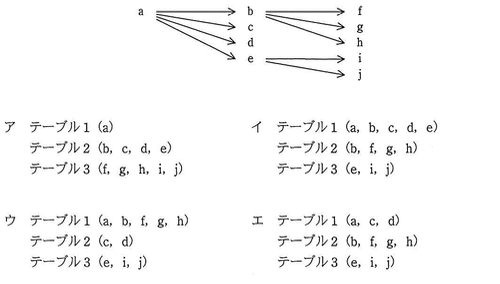

# Lv3

----

**教材制作者へ**

このレベルには，IPA情報処理技術者試験の過去問を用いている。

該当の問題には出典を明記し，出典元と表現が大きく異ならないよう作成すること。

- [過去問題](https://www.jitec.ipa.go.jp/1_04hanni_sukiru/_index_mondai.html)

IPA情報処理技術者試験では，特に指示の無い場合は，ア〜エ（もしくはそれに順ずる英数記号）の単数選択問題とする。

 
 - 注意
 	- アンダーライン等がgithubで消えて見える場合があるので，その場合は過去問やソースコード中の `<u>...</u>` を直接確認してください。

----

## Q1

（出典：応用情報技術者試験 平成22年度春期分 問31 をもとに作成）

データの正規化に関する記述のうち，適切なものはどれか。
  
ア　正規化は，データベースへのアクセス効率を向上させるために行う。 
イ　正規化を行うと，複数の項目で構成される属性は，単一の項目をもつ属性に分解される。 
ウ　正規化を完全に行うと，同一の属性を複数の表で重複して持つことはなくなる。 
エ　非正規形の表に対しては，選択，射影，などの関係演算は実行不可能である。 
  
### ヒント1

正規化とは，表や表の間で管理されるデータの整合性を向上させるために，属性の整理や表の分割といった冗長性の削減を行い，表を定義することである。

正規化が行われていない状態の表を非正規形と呼び，正規化は段階的な手段で行われる。

### ヒント2

正規化はデータの整合性を向上させるために行うものであり，アクセス効率の向上は目的としていない。よって，アは適さない。

非正規形の表であっても，表や行に関する操作や演算を妨げることはない。よって，エは適さない。

### ヒント3

正規化で表の分割などを行っても，属性の間のデータの整合性を保つために，表の間で関連づけを行うための属性を用意することがある。したがって，ウは適さない。

正規化では，属性の中に複数の値がある場合は，単一の項目をもつ属性に分割する（
第一正規化）。よって，イは適している。

答え　イ

## Q2
（出典：基本情報処理技術者試験 平成28年度秋期分 問26　をもとに作成）

E-R図に関する記述のうち，適切なものはどれか。
  
ア　関係データベースの表として実装することを前提に表現する。 
イ　管理の対象をエンティティ及びエンティティ間のリレーションシップとして表現する。 
ウ　データ生成から消滅に至るデータ操作を表現する。 
エ　リレーションシップは，業務上の手順を表現する。 
  
### ヒント1

E-R図とは，システムで扱いたいデータを，実体・関連・属性の観点から図で表現するもので，データベースの概念データモデルや論理データモデルの実現に用いられる。

### ヒント2

E-R図は関係データベースのみを前提としているものではない。したがってアは適さない。

E-R図は実体・関連・属性の観点でデータを表すものであるから，データ生成から消滅に至るデータ操作は表現しない。したがってウは適さない。

### ヒント3

E-R図では，実体をエンティティ（エンティティタイプ），関連をリレーションシップ，属性をアトリビュートと呼ぶ。

管理の対象となるデータを，実体や実体の間の関連で表すことができる。

したがって，エは適さず，イは適している。

こたえ　イ

## Q3

（出典：基本情報処理技術者試験 平成28年度春期分 問29 を元に作成）

関係データベースにおいて，外部キーを定義する目的として，適切なものはどれか。
  
ア　関係する相互のテーブルにおいて，レコード間の参照一貫性が維持される制約をもたせる。 
イ　関係する相互のテーブル格納場所を近くに配置することによって，検索，更新を高速に行う。 
ウ　障害によって破壊されたレコードを，テーブル間の相互の関係から可能な限り復旧させる。 
エ　レコードの削除，追加の繰り返しによる，レコード格納エリアのフラグメンテーションを防止する 
  
### ヒント1

関係データベースでは，正規化などで整合性が整理された複数の表の間で，互いのデータを参照や関連づけを行うための属性を用意する。これを外部キーと呼ぶ。

### ヒント2

外部キーでは，テーブル間の相互の関係からデータの保存や復旧を行えるものではない。よってウは適していない。

また，外部キーはテーブル間の参照や関連づけを行うための属性であるから，レコードのフラグメンテーションを防止することはできない。よってエは適していない。

### ヒント3

外部キーは，データの格納場所や，その検索・更新を高速に行うためのものではない。よって，イは適していない。

外部キーについて適切な説明は，アである。

こたえ　ア

## Q4

（出典：基本情報処理技術者試験 平成26年度秋期分 問28 を元に作成）

関係を第三正規化まで正規化して設計する目的はどれか。
  
ア　値の重複をなくすことによって，格納効率を向上させる。 
イ　関係を細かく分解することによって，整合性制約を排除する。 
ウ　冗長性を排除することによって，更新時異常を回避する。 
エ　属性間の結合度を低下させることによって，更新時のロック待ちを減らす。 
  
### ヒント1

正規化とは，表や表の間で管理されるデータの整合性を向上させるために，属性の整理や表の分割といった冗長性の削減を行い，表を定義することである。

### ヒント2

正規化はあくまで整合性の向上や冗長性の削減を行うものであり，格納効率やパフォーマンスの向上を行うものではない。よって，アおよびエは適していない。

### ヒント3

第3正規化がおこなわエルと，多くの場合，表が分割される。分割された表の間の生合成を保つために，参照制約（外部キー）が用いられる。よって，イは適していない。

冗長性を排除することは，更新時（例：複数ある同じ属性が，一部しか更新されない，など）異常の予防につながる。よって，ウは適している。

答え　ウ
  

## Q5

（出典：基本情報処理技術者試験 平成26年度春期分 問26 をもとに作成）

項目aの値が決まれば項目bの値が一意に定まることを，a→bで表す。例えば，社員番号が決まれば社員名が一意に定まるという表現は，社員番号 → 社員名である。この表現方法に基づいて，図の関係が成立している項目 a~j を，関係データベース上の三つのテーブルで定義する組合わせとして，適切なものはどれか。
  

  
### ヒント1

項目aの値が決まれば項目bが一意に定まることを，関係従属と呼ぶ。

関係データベースでは，関係従属を同じテーブルに定義することを基本とする。

つまり，a→bの関係が成り立つ場合，a→bは同じテーブルに定義できると考えられる。

### ヒント2

設問の図では，a→{b，c，d，e}，b→{f，g，h}，e→{i，j}の三つの関係従属が表されている。

### ヒント3

3つの関係従属を表としてまとめているものは，イである。

答え　イ

## Q6　ドロップダウン

（出典：基本情報処理技術者試験 平成25年度秋期分 問30 をもとに作成）

関係データベースの主キーの制約の条件として，キー値が重複していないことの他に，主キーを構成する列に必要な条件はどれか。

- キー値が空でないこと 
- 構成する列が一つであること 
- 表の先頭に定義されている列であること 
- 別の表の候補キーとキー値が一致していること 
  
### ヒント1

連番やコードといった，属性の関係のタプル（行）を一意に識別できる列（もしくは列の組みあわせで極小のもの）を候補キーとよび，この中で選ばれたものが主キーとなる。

キー値が重複した場合は，行を一意に識別できないため，主キーの制約違反となる。

### ヒント2

主キーは，表の中のどの位置に定義されている列でもかまわない。

また，主キーは表の中で行を一意に識別するものであるため，別の表の候補キーと一致している必要はない。

### ヒント3

一つの属性だけでは業を一意に識別できない場合は，複数の列の組を主キーとする場合がある。したがって，列が必ず一つである必要はない。

列の値が空（NULL）の場合は，行を一意に識別できない。したがって，キー値が空ではないことは，必要な条件である。

答え　キー値が空でないこと

## Q7

（出典：基本情報処理技術者試験 平成24年度秋期分 問26 をもとに作成）

E-R図の説明のうち，適切なものはどれか。
  
ア　エンティティタイプの間には，1対多，多対多などのリレーションシップがある。 
イ　エンティティタイプ間の関連は，参照側から被参照側への方向の矢印線で表現する。 
ウ　エンティティタイプには属性を持たせないで，リレーションシップタイプに属性を持たせる。 
エ　エンティティタイプの中に関連先のエンティティ名を記述することによって，リレーションシップを表す。 
  
### ヒント1

E-R図とは，システムで扱いたいデータを，実体・関連・属性の観点から図で表現するもので，データベースの概念データモデルや論理データモデルの実現に用いられる。

E-R図では，実体をエンティティ（エンティティタイプ），関連をリレーションシップ，属性をアトリビュートと呼び，管理の対象となるデータを，実体や実体の間の関連で表すことができる。

### ヒント2

関連は，その関連の形式によって実践や矢印線をつかいわけることができる。よって，イは適していない。

エンティティタイプの中には，そのデータの実体を表す名前を記載し，エンティティタイプ間を線で結ぶことでリレーションシップに属性を持たせる。よって，エは適していない。

### ヒント3

データの実体が持つ付属情報（属性）は，エンティティタイプに記載する。よって，ウは適していない。

エンティティタイプとリレーションシップを用いることで，1対1，1対多，多対多といったデータの関連を表すことができる。よって，アは適している。

答え　ア

## Q8

（出典：基本情報処理技術者試験 平成21年度秋期分 問32 を元に作成）

関係データベースの主キーの性質として，適切なものはどれか。
  
ア　主キーとした列に対して検索条件を指定しなければ，行の検索はできない。 
イ　数値型の列を主キーに指定すると，その列は算術演算の対象としては使えない。 
ウ　一つの表の中に，主キーの値が同じ行が複数存在することはない。 
エ　複数の列からなる主キーを構成することはできない 

### ヒント1

連番やコードといった，属性の関係のタプル（行）を一意に識別できる列（もしくは列の組みあわせで極小のもの）を候補キーとよび，この中で選ばれたものが主キーとなる。

### ヒント2

一つの属性だけでは業を一意に識別できない場合は，複数の列の組を主キーとする場合がある。したがって，列が必ず一つである必要はない。よって，エは適していない。

主キーは列を一意に識別できるという特性以外は，通常の列と変わらない。したがって，算術演算の対象に用いることができる。よって，イは適していない。

### ヒント3

関係データベースの表では，様々な条件で行の検索を行うことができる。よって，アは適していない。

主キーの値が同じ行があった場合，その行を識別することができなくなってしまう。したがって，主キー列には値を重複させることはできない。よって，ウは適している。

答え　ウ

## Q10 ドロップダウン

（出典：ITパスポート試験　平成28年春期　問94 を元に作成）

商品の仕入れ状況を管理している関係データベースの"仕入一覧"表を正規化して，"仕入"表と”商品”表に分割したい。分割後の二つの表に共通して必要なフィードとして，最も適切なものはどれか。ここで，仕入れは一度に一つの商品だけを仕入れることとし，仕入番号で一意に選別できる。また，商品は商品番号で一意に識別できる。
  

  
- 仕入番号
- 支払い方法
- 商品番号
- 商品名
  
### ヒント1

正規化とは，表や表の間で管理されるデータの整合性を向上させるために，属性の整理や表の分割といった冗長性の削減を行い，表を定義することである。

### ヒント2

設問から，仕入番号が主キーである。また，"仕入"表と"商品"表に分割したいことから，仕入でどの商品を仕入れたか，という情報と，商品は何か，という二つの表に分けることが考えられる。

### ヒント3

設問から，商品の情報は，商品番号で一意に識別できる。これにより，商品番号を"仕入"表と"商品"表の共通フィールドとしておくことで，仕入の情報と，仕入れた商品の情報に，表を分けることができる。

答え　商品番号
