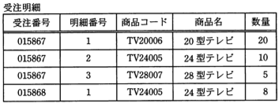

# Lv4

## Q1 ドロップダウン

（出典：応用情報技術者試験 平成22年度春期分 問32 をもとに作成）

  "受注明細"表は，どのレベルまでの正規系の条件を満たしているか。ここで，受注番号と明細番号の組は主キーである。
  

  
- 第1正規形
- 第2正規形
- 第3正規形
- 第4正規形
  
### ヒント1

第1正規形とは，非正規形の表に対し，属性の中に重複や繰り返しとなる項目が残らないように属性を分けたものである。

第2正規形とは，第1正規形の表に対し，主キー・複合キーによって，部分関数従属となる属性を，完全関数従属となるように表に分けたものである。

第3正規形とは，第2正規形の表に対し，主キー・複合キー以外の属性によって，推移的関数従属となる部分を完全関数従属となるように表に分けたものである。

第4正規化とは，第3正規形の表に対し，主キー・複合キーによって，多値従属となる部分を完全関数従属となるように表を分ける。

### ヒント2

元表の属性の中には，値の重複や繰り返しは存在していない。したがって元表は非正規形ではなく，第一正規形である。

### ヒント3

主キーをみると，元表は，受注番号，明細番号を主キーとして，一意性を確保している。したがって，第二正規形である。

主キー以外をみると，元表の商品コードと表品名には対応がみられる。したがって，商品コード→商品名の関数従属（部分的関数従属）が考えられる。この関数従属が別表に分けられていないため，第3正規化は行われていない。

答え　第2正規形

## Q1
Lv4 応用情報技術者試験 平成25年度秋期分 問29 正規化

  第2正規形から第3正規形に変換する手順はどれか。
  
  ア　候補キー以外の属性から,候補キーの一部の属性に対して関数属性がある場合,その関係を分解する。 
  イ　候補キー以外の属性間に関数従属性がある場合,その関係を分解する。 
  ウ　候補キーの一部の属性から,候補キー以外の属性への関数従属性がある場合,その関係を分解する。 
  エ　一つの属性に複数の値が入っている場合,単一の値になるように分解する。 
  
### ヒント1

### ヒント2

### ヒント3  
  答え　イ

## Q2
Lv4 応用情報技術者試験 平成24年度春期分 問27 正規化

  第1,第2,第3正規形とそれらの特徴a~cの組合せとして,適切なものはどれか。
  
  a:どの非キー属性も,主キーの新部分集合に対して関数従属しない。 
  b:どの非キー属性も,主キーに推移的に関数従属しない 
  c:繰返し属性が存在しない 
 
### ヒント1

### ヒント2

### ヒント3 
  答え　ウ

## Q3
Lv4 応用情報技術者試験 平成23年度春期分 問28 制約

  "社員扶養家族"表の列"社員番号"の値が"社員"表の候補キーにしなければならないという制約はどれか
  
  ア　一意性制約 
  イ　形式制約 
  ウ　参照制約 
  エ　ドメイン制約 
  
### ヒント1

### ヒント2

### ヒント3 
  答え　ウ

## Q4
Lv4 応用情報技術者試験 平成22年度秋期分 問29 制約

  関係データベースの候補キーとなる列又は列の組に関する記述として,適切なものはどれか。
  
  ア　値を空値(null)にすることはできない。 
  イ　検索の高速化のために,属性の値と対応するデータの格納位置を記録する。 
  ウ　異なる表の列と関連付けられている 
  エ　表の行を唯一に識別できる 
  
### ヒント1

### ヒント2

### ヒント3 
  答え　エ

## Q5
Lv4 応用情報技術者試験 平成21年度秋期分 問33 データモデル 

  関係データベースにおいて,"注文"表から"商品"表へ参照制約が設定されている場合の記述のうち,適切なものはどれか。
  
  ア　"商品"表のダブルが存在すれば,それに対応する"注文"表のダブルは存在する。 
  イ　"商品"表のダブルと"注文"表のダブルはそれぞれ独立に存在する。 
  ウ　"注文"表のダブルが消滅すれば,それに対応する"商品"表のダブルも消滅する。 
  エ　"注文"表のダブルが存在すれば,それに対応する"商品"表のダブルは存在する。 　　
  
### ヒント1

### ヒント2

### ヒント3 
  答え　エ

## Q6
Lv4 応用情報技術者試験 平成21年度春期分 問32 ER
  次の概念データモデルの解釈として,適切なものはどれか,ここで,モデルの記法としてUMLを用いる。
  
  (ここに画像)
  
  ア　従業員が所属していない部署の存在は許されない。 
  イ　従業員が所属している部署を削除しても,参照整合性は保証される。 
  ウ　従業員は,同時に複数の部署に所属してもよい。 
  エ　どの部署にも所属しない従業員が存在してもよい。 
  
### ヒント1

### ヒント2

### ヒント3 
  答え　ウ

## Q7
Lv4 応用情報技術者試験 平成21年度春期分 問34 制約

  関係データベースの"注文"表又は"商品"表の行を削除する場合,"注文明細"表に対する操作として,適切な組み合わせはどれか。
  ここで,表定義中の実線の下線は主キーを,破線の下線は外部キーを表す
  
  [削除時の操作]
  A:主キー側の行を削除する場合,それを参照している外部キー側の行を同時に削除する。
  B:主キー側の行を削除する際,それを参照している外部キー側の行があれば,主キー側の行の削除を許さない。
  
  (選択肢、参考画像)
  
### ヒント1

### ヒント2

### ヒント3 
  答え　イ

## Q8
Lv4 基本情報技術者試験 平成28年度秋期分 問27 ER

  6行から成る"配送"表において成立している関数従属はどれか。
  ここでX→Yは,XはYを関数的に決定することを表す。
  
  (画像)
  
  ア　配送先　→　部品ID 
  イ　配送日　→　部品ID 
  ウ　部署ID　→　部品ID 
  エ　部署名　→　配送先 
  
### ヒント1

### ヒント2

### ヒント3 
  答え　ア

## Q9
Lv4 基本情報技術者試験 平成25年度春期分 問26 データモデル

  UMLを用いて表した図のデータモデルに対する多重度の説明のうち,適切なものはどれか。
  
  (ここに画像)
  
  ア　社員が複数のプロジェクトに参画する場合は,全て同じ役割分担となる。 
  イ　社員は,同じプロジェクトに異なる役割分担で参画することができる 
  ウ　社員は,一つ以上のプロジェクトに参画している。 
  エ　社員は,複数の部門に所属することができる。 
  
### ヒント1

### ヒント2

### ヒント3 
  答え　イ

## Q10
Lv4 基本情報技術者試験 平成21年度春期分 問32 正規化

  "従業員"表を第3正規形にしたものはどれか。ここで,下線部は主キーを表す。
  
  (ここに表の画像と選択肢の画像)
  
### ヒント1

### ヒント2

### ヒント3 
  答え　ウ

## Q11
Lv4 基本情報技術者試験 平成22年度秋期分 問29 正規化

  次の"受注台帳"表を"注文"表と"顧客"表に分解し,第3正規形にしたとき,両方に必要な属性はどれか。
  ここで,送付先と支払方法は注文ごとに決めるものとする。また、表の下線は主キーを表す。
  
  (ここに画像)
  
  ア　顧客ID 
  イ　顧客名 
  ウ　支払方法 
  エ　注文番号 
  
### ヒント1

### ヒント2

### ヒント3 
  答え　ア

## Q12
Lv4 情報処理技術者試験 平成22年度春期分 問30 正規化

  "発注伝票"表を第3正規形に書き換えたものはどれか。ここで,下線部は主キーを表す。
  
  (ここに画像、選択肢の画像も)
  
### ヒント1

### ヒント2

### ヒント3 
  答え　ウ
