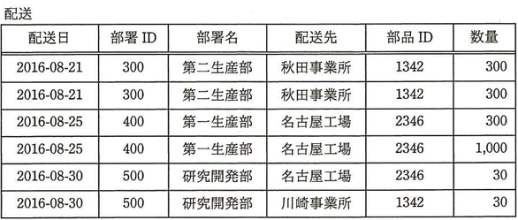
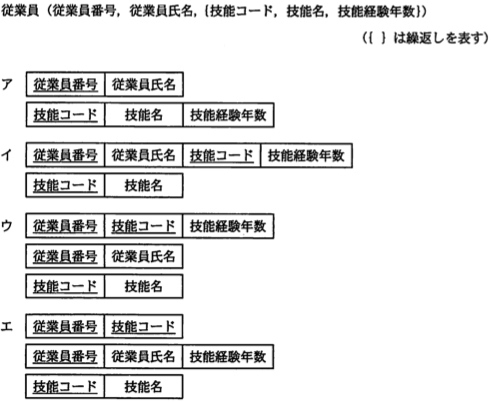
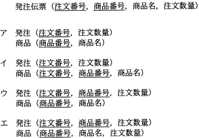
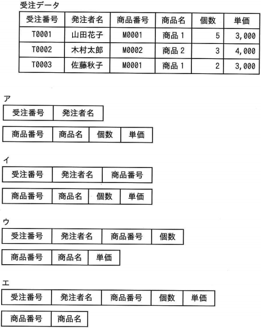

# Lv4

----

**教材制作者へ**

このレベルには，IPA情報処理技術者試験の過去問を用いている。

該当の問題には出典を明記し，出典元と表現が大きく異ならないよう作成すること。

- [過去問題](https://www.jitec.ipa.go.jp/1_04hanni_sukiru/_index_mondai.html)

IPA情報処理技術者試験では，特に指示の無い場合は，ア〜エ（もしくはそれに順ずる英数記号）の単数選択問題とする。

 
 - 注意
 	- アンダーライン等がgithubで消えて見える場合があるので，その場合は過去問やソースコード中の `<u>...</u>` を直接確認してください。

----

## Q1 ドロップダウン

（出典：応用情報技術者試験 平成22年度春期分 問32 をもとに作成）

  "受注明細"表は，どのレベルまでの正規系の条件を満たしているか。ここで，受注番号と明細番号の組は主キーである。
  

  
- 第1正規形
- 第2正規形
- 第3正規形
- 第4正規形
  
### ヒント1

第1正規形とは，非正規形の表に対し，属性の中に重複や繰り返しとなる項目が残らないように属性を分けたものである。

第2正規形とは，第1正規形の表に対し，主キー・複合キーによって，部分関数従属となる属性を，完全関数従属となるように表に分けたものである。

第3正規形とは，第2正規形の表に対し，主キー・複合キー以外の属性によって，推移的関数従属となる部分を完全関数従属となるように表に分けたものである。

第4正規化とは，第3正規形の表に対し，主キー・複合キーによって，多値従属となる部分を完全関数従属となるように表を分ける。

### ヒント2

元表の属性の中には，値の重複や繰り返しは存在していない。したがって元表は非正規形ではなく，第一正規形である。

### ヒント3

主キーをみると，元表は，受注番号，明細番号を主キーとして，一意性を確保している。したがって，第二正規形である。

主キー以外をみると，元表の商品コードと表品名には対応がみられる。したがって，商品コード→商品名の関数従属（部分的関数従属）が考えられる。この関数従属が別表に分けられていないため，第3正規化は行われていない。

答え　第2正規形

## Q2　ドロップダウン

（出典：基本情報技術者試験 平成28年度秋期分 午前 問27 をもとに作成）

  6行から成る"配送"表において成立している関数従属はどれか。
  ここでX→Yは，XはYを関数的に決定することを表す。
  
  
  
- 配送先　→　部品ID
- 配送日　→　部品ID
- 部署ID　→　部品ID
- 部署名　→　配送先
  
### ヒント1

項目aの値が決まれば項目bが一意に定まることを，関係従属と呼ぶ。

### ヒント2

部署名 が 研究開発部 のとき，組となる配送先は2つある。部署名と配送先は関数従属していない。

部署ID が 500 のとき，組となる部品IDは２つある。部署IDと部品IDは関数従属していない。。

### ヒント3 

配送日 が 2016-08-30 のとき，組となる部品IDは2つある。配送日と部品IDは関数従属していない。

配送先 が 秋田事業所 のとき，組となる部品IDは 1342 である。
同様に 名古屋工場 のときは 2346 ， 川崎事業所 の時は 1342 である。

配送先と組となる部品IDは複数存在しない（関数従属している）。
配送先と部品IDは関数従属しておい，配送先が部品IDを関数的に決定する。
  
答え　ア

## Q3

（出典：基本情報技術者試験 平成21年度春期分 午前 問32 をもとに作成）

  "従業員"表を第3正規形にしたものはどれか。ここで，下線部は主キーを表す。
  
  
  
### ヒント1

第1正規形とは，非正規形の表に対し，属性の中に重複や繰り返しとなる項目が残らないように属性を分けたものである。

第2正規形とは，第1正規形の表に対し，主キー・複合キーによって，部分関数従属となる属性を，完全関数従属となるように表に分けたものである。

第3正規形とは，第2正規形の表に対し，主キー・複合キー以外の属性によって，推移的関数従属となる部分を完全関数従属となるように表に分けたものである。

### ヒント2

{技能コード， 技能名， 技能経験年数} の繰り返しを排除する（第1正規形）にするためには，従業員番号，従業員氏名と繰り返しの中の要素の中から複合主キーとなることを前提に候補キーを定める。

アは，複合主キーがないため，適切ではない。

エは，繰り返し項目の中で技能経験年数を一意に特定できないため，適切ではない。

### ヒント3 

イは，従業員番号に対する従業員氏名が部分関数従属として分離されていない。従って，適切ではない。

ウは，部分的関数従属，推移的関数従属が全て完全関数従属となっている。

答え　ウ

## Q4　ドロップダウン

（出典：基本情報技術者試験 平成22年度秋期分 午前 問29 をもとに作成）

  次の"受注台帳"表を"注文"表と"顧客"表に分解し，第3正規形にしたとき，両方に必要な属性はどれか。
  ここで，送付先と支払方法は注文ごとに決めるものとする。また，表の下線は主キーを表す。
  

  
- 顧客ID
- 顧客名
- 支払方法
- 注文番号
  
### ヒント1

第1正規形とは，非正規形の表に対し，属性の中に重複や繰り返しとなる項目が残らないように属性を分けたものである。

第2正規形とは，第1正規形の表に対し，主キー・複合キーによって，部分関数従属となる属性を，完全関数従属となるように表に分けたものである。

第3正規形とは，第2正規形の表に対し，主キー・複合キー以外の属性によって，推移的関数従属となる部分を完全関数従属となるように表に分けたものである。

### ヒント2

重複項目がないため，部分関数従属である顧客IDを完全関数従属になるよう表を分ける。

注文（<u>注文番号</u>，注文年月日， <u>顧客ID</u>， 品目， 数量， 送付先， 支払方法， 受注金額）

顧客（<u>顧客ID</u>，顧客名， 顧客住所）

### ヒント3 

これ以上の正規化は，主キーや候補キーに影響しない。

第三正規化は，"注文"表と"顧客"表に影響しない。

"注文"表と"顧客"表の両方に存在するものは，"顧客ID"

答え　顧客ID

## Q5

（出典：情報処理技術者試験 平成22年度春期分 午前　問30 をもとに作成）

  "発注伝票"表を第3正規形に書き換えたものはどれか。ここで，下線部は主キーを表す。
  

  
### ヒント1

第1正規形とは，非正規形の表に対し，属性の中に重複や繰り返しとなる項目が残らないように属性を分けたものである。

第2正規形とは，第1正規形の表に対し，主キー・複合キーによって，部分関数従属となる属性を，完全関数従属となるように表に分けたものである。

第3正規形とは，第2正規形の表に対し，主キー・複合キー以外の属性によって，推移的関数従属となる部分を完全関数従属となるように表に分けたものである。

### ヒント2

エはテーブル結合を行った結果，発注伝票が復元できない。従って適切ではない。

重複項目は存在しないので，第２正規化を行う。

注文数量は，注文番号，商品番号が決まれば一意となる。

したがって，アは適切ではない。

### ヒント3 

イは，主キーの一部である商品番号に関数従属する商品名が，部分関数従属のまま残っている。従って適切ではない。

ウは，部分関数従属・推移的関数従属が存在せず，完全関数従属の状態である。したがって，第三正規化まで正しくわれている。

答え　ウ
  

## Q6

（出典：基本情報技術者試験 平成25年度春期分 午前 問26 をもとに作成）

  UMLを用いて表した図のデータモデルに対する多重度の説明のうち，適切なものはどれか。
  

  
  ア　社員が複数のプロジェクトに参画する場合は，全て同じ役割分担となる。 
  イ　社員は，同じプロジェクトに異なる役割分担で参画することができる 
  ウ　社員は，一つ以上のプロジェクトに参画している。 
  エ　社員は，複数の部門に所属することができる。 
  
### ヒント1

選択肢が求める多重度と図の多重度を比べて判断する。

社員対部門は 1..\* 対 1 である。つまり，社員は1つの部門に所属する，部門は所属する社員を1人以上もつ。したがって，エは適さない。

### ヒント2

社員対プロジェクト参画は 1 対 0..\* である。つまり，社員はひとつのプロジェクトにも参加しないか，複数のプロジェクトに参加できる。したがって，ウは適さない。

### ヒント3 

プロジェクト参画は，社員とプロジェクト内の役割分担の関連エンティティである。

したがって，社員対役割分担は 1:0..\*となる。したがって，アは適せず，イは適している。

  答え　イ

## Q7 ドロップダウン

（出典：情報処理技術者試験 平成23年度秋期分 前期分 問33 をもとに作成）

UMLを表した図のデータモデルの解釈のうち，適切なものはどれか。
  

  
- 1回の納品に対して分割請求ができる 
- 顧客の請求を支払で相殺できる 
- 請求処理を納品と同時に実行される。 
- 複数回の納品分をまとめて請求できる。 
  
### ヒント1

選択肢が求める多重度と図の多重度を比べて判断する。

納品には請求が存在しないか，ひとつだけ存在する。

### ヒント2

請求には必ず1つ以上の納品が存在する。

したがって，請求処理を納品と同時に実行することはできない。

### ヒント3

納品の請求を分割することはできない。

顧客の請求を支払いで相殺できない。

請求には必ず1つ以上の納品が存在するので，複数回の納品をまとめて請求できる。

  答え　複数回の納品分をまとめて請求できる

## Q8 ドロップダウン

（出典：情報処理技術者試験 平成23年度特別分 午前 問29 をもと作成）

UMLを用いて表した図のデータモデルの多重度の説明のうち，適切なものはどれか。
  

- 社員が1人も所属しない組織は存在しない。
- 社員は必ずしも組織に所属しなくてもよい。
- 社員は複数の組織に所属することができる。
- 一つの組織に複数の社員は所属できない。

### ヒント1

選択肢が求める多重度と図の多重度を比べて判断する。

組織には１人以上の社員が存在する。

### ヒント2

社員には１つの組織が存在する。

したがって，社員は必ず組織に存在しなくてはならない。

１つの組織に複数の社員が所属できる。

### ヒント3

社員は１つの組織にのみ所属できる。

社員が１人も所属しない組織は存在しない。

  答え　社員が１人も所属しない組織は存在しない。

## Q9

（出典：ITパスポート試験 平成26年春期　問60　をもとに作成）

  ファイルで管理されていた受注データを，受注に関する情報と商品に関する情報に分割して，正規化を行った上で関係データベースの表で管理する。
  正規化を行った表の組合せ，最も適切なものはどれか。ここで，同一商品名で単価が異なるときは商品番号も異なるものとする。
  

  
### ヒント1

第1正規形とは，非正規形の表に対し，属性の中に重複や繰り返しとなる項目が残らないように属性を分けたものである。

第2正規形とは，第1正規形の表に対し，主キー・複合キーによって，部分関数従属となる属性を，完全関数従属となるように表に分けたものである。

第3正規形とは，第2正規形の表に対し，主キー・複合キー以外の属性によって，推移的関数従属となる部分を完全関数従属となるように表に分けたものである。

### ヒント2

重複するデータや列は存在しないため，第2正規化を行う。

複合主キーとなる候補キーに着目し，部分関数従属となる属性を完全関数従属となるように表を分ける。

設問から，受注データ表を，受注表と商品表に分けることを考えると，商品番号→商品の部分関数従属を完全関数従属として表を分ける。

### ヒント3

ただし設問では，単価が異なるときに商品番号が異なるという指示があることから，単価についても商品表に含める。

上記に当てはまる表は，ウである。

  答え　ウ
  
## Q10

Lv4 応用情報技術者試験 平成21年度秋期分 問33 データモデル 

  関係データベースにおいて，"注文"表から"商品"表へ参照制約が設定されている場合の記述のうち，適切なものはどれか。
  
  ア　"商品"表のダブルが存在すれば，それに対応する"注文"表のダブルは存在する。 
  イ　"商品"表のダブルと"注文"表のダブルはそれぞれ独立に存在する。 
  ウ　"注文"表のダブルが消滅すれば，それに対応する"商品"表のダブルも消滅する。 
  エ　"注文"表のダブルが存在すれば，それに対応する"商品"表のダブルは存在する。 　　
  
### ヒント1

参照制約とは，外部キーを用いて表間の従属や依存関係を表す場合に，参照先のタプルと参照元のタプルに不整合が起きないよう，追加・更新・削除といった操作に定められる制約のこと。

設問から，"注文"表の外部キーが"商品"表の主キーを参照している場合を想定し，正しいものを選ぶ。

### ヒント2

"注文"表のタプルを追加するためには，予め，"商品"表に対応するタプルが必要となる。
したがって，アは適切ではない。

"商品"表にないタプルは，"注文"表から依存・参照することはできない。外部キー・候補キーなどで従属や依存するカラムをもつタプルが存在する。従ってイは適切ではない。

### ヒント3 

"注文"表のタプルの消滅は，"商品"表のタプル状況に関わりなく行える。
したがって，ウは適切ではない。

"注文"表のタプルが存在する場合は，その依存・参照先となる"商品"表に必ずタプルが存在する。
したがって，エは適切である。

  答え　エ
